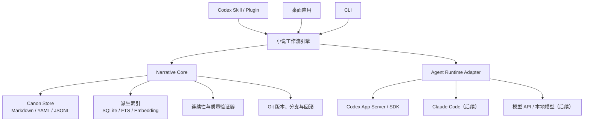

# AI 长篇小说创作系统设计方案

> 状态：讨论稿 v0.2
> 日期：2026-07-24

> 产品边界已确定为纯本地客户端，不建设远程业务服务或网页生成端。MVP 聚焦 Codex Plugin / Skill、CLI 和 Narrative Core；桌面端与本地安装程序在 Core 验证后实现。

## 1. 项目愿景

构建一套面向长篇小说创作的人机协作系统。前期利用 Codex 等订阅型智能体在本地项目中完成规划、写作、校验和修订；后期发展为独立本地桌面应用，并可按需支持 Claude Code、模型 API 和本地模型等不同执行器。

系统的核心定位不是“让模型在一次对话中记住整本小说”，而是：

> AI 负责推理和写作，系统负责记忆、状态管理、连续性校验、版本控制与人类决策。

## 2. 可行性结论

| 目标 | 可行性 | 说明 |
| --- | --- | --- |
| 辅助作者长期创作并保持一致 | 高 | 最适合的初期产品定位 |
| 自动生成结构完整的长篇初稿 | 中高 | 依赖严格工作流和人工决策 |
| 自动发现人物、时间线、设定冲突 | 高 | 需要先将关键信息结构化 |
| 一键生成百万字可出版小说 | 低 | 审美、原创性和长期节奏仍需人类主导 |
| 使用 Codex 订阅完成个人 MVP | 高 | 可直接操作项目文件、脚本和版本 |
| 依赖个人订阅支撑商业 SaaS | 风险较高 | 配额、认证和服务条款不能成为唯一基础 |

长篇创作的关键难题不是模型的单次生成能力，而是长期叙事状态的可靠维护。只要把模型从“唯一记忆载体”降级为可替换的执行器，系统就具备工程可行性。

## 3. 总体架构

产品表面由 Codex 插件和桌面应用组成，但二者必须共享一个独立、无界面的 Narrative Core。



架构遵循三项原则：

1. Narrative Core 不依赖任何具体模型或智能体产品。
2. Markdown、YAML 和 JSONL 是可审查的事实源；数据库索引和向量索引应当可重建。
3. Codex、Claude Code、模型 API 和本地模型都是可替换的 Agent Runtime。

## 4. 叙事记忆模型

系统必须区分三种状态：

1. 世界中的客观真相。
2. 某个故事时间点的实际状态。
3. 每个人在该时间点知道、相信或误以为什么。

例如，“凶手是甲”属于世界真相，“侦探怀疑乙”属于人物认知。两者不能被压缩成同一条普通摘要，否则会造成视角知识泄漏。

### 4.1 Character

人物对象至少包含：

- 核心性格与稳定价值观
- 当前目标、欲望、恐惧和底线
- 人际关系
- 身体、身份、位置和资源状态
- 语言习惯与行为模式
- 已知信息、错误认知和秘密
- 按场景记录的状态变化历史

人物性格不能只表示成若干形容词，还应表示成“面对某类刺激时倾向采取什么行动”，用于判断行为是否失真。

### 4.2 Event

事件对象至少包含：

- 故事内发生时间
- 文本中的叙述顺序
- 地点、参与者和见证者
- 前置条件与结果
- 原因事件与后续事件
- 哪些人物知道该事件
- 来源章节和文本位置

故事时间和叙述顺序必须分离，以支持倒叙、多视角、时间循环和不可靠叙述者。

### 4.3 Fact

事实对象建议包含：

```text
subject
predicate
object
valid_from
valid_until
known_by
source_scene
confidence
canon_status
```

每条正式事实都必须能够追溯到来源章节或人工设定。摘要丢失细节时，系统仍能返回原文证据。

### 4.4 Plot Thread

剧情线记录：

- 起点与对读者作出的叙事承诺
- 当前状态
- 关联人物
- 最近推进场景
- 已埋伏笔
- 预期回收方式和回收区间
- 实际回收场景

建议使用 `open`、`advancing`、`dormant`、`resolved` 和 `abandoned` 等状态。

### 4.5 Scene Card

每个场景在生成正文前应具备场景卡：

- 视角人物
- 场景目的
- 冲突
- 情绪和信息转折
- 进入状态与离开状态
- 推进的剧情线
- 必须出现与禁止出现的信息
- 目标篇幅和节奏

场景卡是规划阶段和正文生成阶段之间的契约。

## 5. Canon 与草稿隔离

模型生成的正文不能直接改变正式设定。每次场景写作应经过以下过程：

```text
生成正文
→ 提取候选事件和状态变化
→ 与当前 Canon 比较
→ 检测冲突
→ 人工或规则确认
→ 事务性更新正文、事件、人物状态和剧情线
→ 重建派生索引
```

每个场景应产生一个状态变化集：

```yaml
character_changes: []
knowledge_changes: []
relationship_changes: []
events_created: []
facts_proposed: []
threads_advanced: []
threads_resolved: []
new_questions: []
```

草稿可以丢弃，只有审核后的 Canon 才能成为后续创作的正式记忆。

## 6. Context Compiler

生成场景时，系统不应简单执行向量搜索，而应通过 Context Compiler 按规则编译上下文包。

上下文包建议包含：

1. 全书创作契约：类型、主题、基调和禁区。
2. 当前卷和当前剧情弧的目标。
3. 当前场景卡。
4. 出场人物在场景开始前的状态快照。
5. 相关人物的认知、误解与秘密权限。
6. 相关历史事件及其因果链。
7. 正在推进的剧情线和伏笔。
8. 最近相邻场景原文。
9. 少量相关历史原文和风格样例。
10. 当前任务的输出格式与验收条件。

检索优先级：

1. ID、时间、人物、地点、剧情线等确定性查询。
2. 全文检索。
3. 语义向量检索。

向量检索只用于发现可能相关的文本，不承担最终事实判断。

## 7. 长篇创作工作流

系统采用滚动规划：

- 全书层：终局、主题和核心叙事承诺。
- 分卷层：卷目标、主要转折和人物阶段。
- 剧情弧层：规划一组相关章节或场景。
- 近景层：详细规划接下来若干章节。
- 场景层：生成、提取、校验和批准。

单场景工作流：

```text
选择下一场景
→ 生成或确认场景卡
→ 编译上下文包
→ 写初稿
→ 人物声音审查
→ 连续性审查
→ 因果和节奏审查
→ 提取 State Delta
→ 展示正文和 Canon 变更 Diff
→ 人工批准
→ 保存版本
```

“写手”和“审稿人”应使用不同的提示流程，即使初期由同一个底层模型执行。

## 8. Codex Skill 与插件

初期先使用本地 Skill 和 CLI 迭代工作流，待流程稳定并需要分发时再打包成插件。建议提供：

- `$novel-init`：创建小说项目和创作契约
- `$novel-ingest`：导入已有正文并建立初始 Canon
- `$novel-plan`：生成分卷、剧情弧和场景卡
- `$novel-write`：编译上下文并写指定场景
- `$novel-check`：检查人物、时间、知识和设定冲突
- `$novel-reconcile`：提取并审核状态变化
- `$novel-rewrite`：在不改变 Canon 的条件下重写
- `$novel-export`：导出完整稿件

`AGENTS.md` 只保存项目中永久适用的简短规则；复杂流程、脚本和参考资料放在 Skill 中。

## 9. 桌面应用职责

桌面端不应只是聊天界面，而应提供：

- 卷、章和场景树
- 故事时间线
- 人物状态与人物弧
- 人物关系图
- 剧情线和伏笔看板
- 世界设定库
- 正文编辑器
- 上下文包查看器
- 连续性冲突报告
- Canon 变更 Diff
- 分支方案比较
- 运行记录、额度展示和失败恢复

桌面端通过 Agent Runtime Adapter 接入 Codex，并为未来的 Claude Code、模型 API 和本地模型保留统一接口。

## 10. 类型扩展

小说类型不应硬编码在 Narrative Core 中，而应以 Genre Pack 扩展：

- 数据模型扩展
- 类型规划模板
- 专用验证器
- 提示资源
- 评测案例

示例：

- 悬疑：线索、嫌疑人认知、误导和揭示顺序。
- 玄幻：等级、资源、功法规则和战力约束。
- 历史：日期、地理、人物年龄和史实来源。
- 言情：关系阶段、情感债务和亲密度转折。
- 无限流：副本规则、任务条件、物品和能力继承。
- 群像：视角分配、人物曝光度和剧情线覆盖率。

第一版应保持核心通用，但只选择一个类型作为端到端标杆。

## 11. MVP 验收方向

第一阶段需要证明：

1. 能导入一部已有的多章节小说并提取人物、事件和剧情线。
2. 能在不输入整本正文的情况下为下一场景生成可靠上下文包。
3. 能发现人工植入的时间、人物知识、地点和设定冲突。
4. 能连续创作多个场景，并让新增事实可追溯、可审核和可回滚。
5. 能替换 Agent Runtime，而不改动 Narrative Core。

建议里程碑：

- M0：领域模型、项目目录、Schema 和评测样本。
- M1：Narrative Core 与 CLI。
- M2：本地 Codex Skills，跑通完整写作闭环。
- M3：封装为 Codex 插件。
- M4：桌面端接入 Codex App Server。
- M5：Claude Code、模型 API 和本地模型适配。
- M6：本地安装、升级、数据迁移、版权与商业化能力。

## 12. 核心竞争力

项目的长期竞争力不取决于绑定某一个当前最强模型，而在于：

> 对长篇叙事状态的建模、上下文编译、连续性验证，以及人类与 AI 共同决策的工作流。
