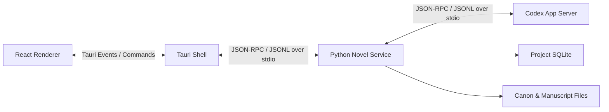

# 计算架构与技术栈候选方案

> 状态：纯本地架构候选方案 v0.2
> 日期：2026-07-24
> 关联文档：[AI 长篇小说创作系统设计方案](./01-system-design.md)

相关设计：

- [MVP Narrative Core 核心架构](./03-mvp-core-architecture.md)
- [历史情节的检索](./04-historical-plot-retrieval.md)
- [运行环境与本地分发](./05-runtime-and-local-distribution.md)

> 2026-07-23 决策：产品定位为纯本地客户端，不提供网页端小说生成，不建设远程业务服务。此前关于 PostgreSQL、Redis、对象存储和云端 FastAPI 服务的候选内容已从 MVP 架构中移除。

## 1. 决策目标

本阶段需要确认的不是所有库的最终版本，而是决定以下长期边界：

1. Narrative Core 使用什么语言实现。
2. Codex 插件、CLI 和桌面应用如何共享同一个本地核心。
3. 哪些数据是正式事实源，哪些只是可重建索引或缓存。
4. 桌面应用与本地服务、Codex 运行时之间使用什么协议。
5. Codex 插件、CLI 与未来桌面客户端如何共享同一个本地核心。

## 2. 推荐结论

建议采用：

| 层 | 推荐技术 |
| --- | --- |
| 领域核心与本地应用服务 | Python 3.12+、Pydantic |
| CLI | Typer 或等价的轻量 CLI 层 |
| 本地异步任务与进程管理 | asyncio |
| 本地 IPC | JSON-RPC / JSONL over stdio |
| 数据访问与迁移 | Python `sqlite3` + 显式 SQL migrations |
| 桌面端 | Tauri 2、React、TypeScript |
| 本地数据库 | SQLite，启用 WAL |
| 全文检索 | SQLite FTS5；中文优先评估 trigram tokenizer |
| 正式文档 | Markdown、YAML Front Matter、JSONL |
| 本地缓存 | 内存 LRU + 内容寻址磁盘缓存 |
| 本地任务队列 | SQLite 持久化任务表 |
| 版本管理 | Git + 应用层变更集 |
| 二进制附件 | 本地 assets 目录 |

架构形态为：

> 纯本地的模块化单体，使用端口与适配器隔离 Codex、存储和桌面 UI。

本项目不采用远程业务服务、微服务、Redis、独立图数据库或独立向量数据库。MVP 阶段也不实现桌面端，先验证 Codex 插件与 Narrative Core 的协作闭环。

## 3. 为什么选择 Python 作为 Narrative Core

本系统的主要计算任务是：

- 文档解析与变更
- Schema 校验
- 上下文编译
- 文本分块与检索
- 模型和智能体进程调度
- 连续性规则检查
- 后续可能出现的 NLP、Embedding 和评测任务

这些任务更看重开发效率、文本处理生态和可测试性，而不是极限吞吐量。Python 适合作为单一的领域核心，同时可以：

- 直接提供 Codex 可调用的 CLI。
- 通过 `asyncio` 管理 Codex App Server 等长时间运行的子进程。
- 通过 Pydantic 同时定义领域 Schema、JSON Schema 和接口校验。
- 后续作为桌面 sidecar，通过 stdio JSON-RPC 提供本地接口。

领域模型必须是纯 Python 包，不能依赖桌面框架或具体模型 SDK。纯本地产品不需要 Web 框架。

## 4. 桌面端选择

### 4.1 推荐：Tauri 2 + React + TypeScript

职责分配：

- React/TypeScript：编辑器、时间线、人物关系、Diff、任务进度和审批界面。
- Tauri/Rust Shell：窗口、文件系统权限、系统菜单、自动更新、进程托管和前端 IPC。
- Python Sidecar：Narrative Core、本地数据库、Context Compiler、校验器和 Agent Runtime。

Rust 层保持很薄，不承载叙事业务规则。这样团队主要维护 Python 和 TypeScript 两套业务代码，Rust 只作为受控的桌面系统桥。

Tauri 官方支持将外部二进制作为 sidecar 打包，因此发布时可以把 Python 服务编译或封装为独立 sidecar，不要求最终用户预装 Python。

### 4.2 备选：Electron + React + TypeScript

Electron 的优势是桌面生态成熟、Chromium 行为一致、Node 子进程控制直接；缺点是安装包和运行内存更大，并且应用边界更容易与 Node 主进程耦合。

如果团队完全不希望维护少量 Rust 桥接代码，Electron 是合理备选。但无论使用 Tauri 还是 Electron，Narrative Core 都不应写进桌面主进程。

## 5. 进程与通信架构

MVP 只使用 Codex、Skill 和 CLI。未来进入桌面阶段后，由桌面端启动两个本地子进程：



选择 stdio 而不是默认监听本地 HTTP 端口，原因是：

- 不需要处理端口冲突。
- 不会意外暴露到局域网。
- 子进程生命周期天然从属于桌面应用。
- JSONL 适合流式传递 Agent 事件。
- 与 Codex App Server 的通信模型相似。

MVP 和未来桌面发行版均不需要启动本地 Web 服务，也不开放本地网络端口。

## 6. Agent Runtime 边界

Narrative Core 只依赖抽象接口：

```text
AgentRuntime
  start_session()
  run_turn(task, context_manifest)
  stream_events()
  request_approval()
  cancel()
  inspect_usage()
  close()
```

初期实现：

- `CodexAppServerRuntime`
- `CodexCliRuntime`，作为降级和调试通道

后续实现：

- `ClaudeCodeRuntime`
- `OpenAIApiRuntime`
- `AnthropicApiRuntime`
- `LocalModelRuntime`

所有 Runtime 返回统一的任务事件、工具调用、用量、错误和候选变更集，不能让 Codex 特有的 Thread 或 Turn 类型渗透进领域层。

## 7. 本地应用服务

本产品不建设远程业务服务。MVP 中所谓“后端”是 Narrative Core 提供的本地 Python Application Service。

在 Codex 插件阶段，服务以 CLI 命令和短生命周期进程为主；需要流式任务时使用 JSONL。桌面阶段再将同一核心封装为长生命周期 sidecar，并通过 stdio JSON-RPC 通信。

本地应用服务不监听网络端口，不承担用户账户、云同步、多租户、计费或在线任务分发。

## 8. 数据分层

系统数据分为四层：

### 8.1 正式事实源

使用 Git 跟踪的 Markdown、YAML Front Matter 和 JSONL：

- 原稿
- 人物与世界设定
- 场景卡和剧情规划
- 已批准的事件与事实
- Genre Pack
- 项目配置

正式事实不能只存在于 SQLite 中。

### 8.2 事务与运行状态

SQLite 保存：

- 工作流任务状态
- 未批准候选变更
- 索引版本
- 文档哈希
- 运行记录元数据
- 锁和恢复信息

### 8.3 派生索引

可从正式文件重建：

- 实体和关系投影
- 人物时间状态快照
- 剧情线状态
- FTS5 全文索引
- 文本块
- Embedding

### 8.4 缓存

可以安全删除：

- 已编译上下文包
- Prompt 中间结果
- 模型输出的临时流
- 文档解析 AST
- 缩略图和可视化布局

## 9. 项目级存储结构

建议一个小说对应一个可独立迁移和版本控制的项目：

```text
my-novel/
├── novel.yaml
├── AGENTS.md
├── canon/
│   ├── characters/
│   ├── locations/
│   ├── organizations/
│   ├── world/
│   └── timeline/
├── structure/
│   ├── volumes/
│   ├── arcs/
│   ├── chapters/
│   └── scenes/
├── manuscript/
│   ├── volume-001/
│   └── volume-002/
├── style/
├── genres/
├── assets/
├── runs/
└── .novel/
    ├── project.sqlite
    ├── cache/
    ├── locks/
    └── tmp/
```

建议：

- `novel.yaml`：项目身份、类型、语言、目标篇幅和全局配置。
- 人物与世界条目：Markdown + YAML Front Matter，兼顾结构化字段和自由说明。
- 结构规划：YAML。
- 正文：UTF-8 Markdown。
- 事件账本和运行事件：JSONL。
- `.novel/`：数据库、索引和缓存，默认不纳入 Git。
- `runs/`：是否纳入 Git 由项目配置决定；至少保存可审计的 Context Manifest 和变更摘要。

正文的最小生成和审核单元是 Scene。可以采用“一场景一文件”，再由 Chapter 元数据规定组合顺序；桌面 UI 将其呈现为连续章节，导出时合并。

## 10. SQLite 设计

每个小说项目使用一个 SQLite 数据库：

```text
.novel/project.sqlite
```

推荐设置：

- WAL 模式
- 外键约束
- 明确的 Schema 版本
- 单写者项目锁
- 自动 checkpoint 与异常恢复测试

建议表组：

- `documents`
- `document_revisions`
- `entities`
- `entity_aliases`
- `facts`
- `events`
- `event_participants`
- `knowledge_states`
- `relationships`
- `plot_threads`
- `scene_snapshots`
- `text_chunks`
- `embeddings`
- `workflow_jobs`
- `workflow_events`
- `candidate_changes`
- `index_versions`

FTS5 负责本地全文检索。中文文本需要专门测试分词质量；MVP 可以优先评估 trigram tokenizer，并将人物名、地点名和专有名词继续交给确定性字段查询。

SQLite 不是 Canon 的唯一存储，而是正式文件的查询投影与本地事务状态。

## 11. 向量检索

MVP 不引入独立向量数据库。

建议过程：

1. 先完成确定性检索和 FTS5。
2. 将文本块 Embedding 保存在 SQLite BLOB 或旁路文件中。
3. 对单本小说的有限文本块在 Python 进程中执行相似度计算。
4. 当跨项目语料、团队知识库或规模证明存在瓶颈时，再评估专用向量方案。

Embedding 缓存键必须包含：

```text
content_hash
embedding_provider
embedding_model
chunking_version
normalization_version
```

更换模型或切块策略时可以增量重建。

## 12. 缓存策略

### 12.1 本地

不使用 Redis，采用：

- 进程内 LRU/TTL：短期实体快照和查询结果。
- SQLite：需要崩溃恢复的任务状态和缓存元数据。
- 内容寻址文件缓存：Context Pack、解析结果和较大模型产物。

Context Pack 缓存键至少由以下内容决定：

```text
task_spec_hash
canon_revision
scene_revision
retrieval_policy_version
runtime_profile
prompt_template_version
```

任何正式文件变化后，只失效受影响的缓存，不进行全项目清空。

## 13. 事务、版本和回滚

一次场景批准是一个应用层事务：

1. 校验所有目标文件的旧版本哈希。
2. 写入临时文件。
3. 更新正式文档。
4. 记录变更集。
5. 更新或重建 SQLite 投影。
6. 生成 Git Diff。
7. 可选地创建 Git checkpoint。

数据库事务无法原子覆盖文件系统和 Git，因此需要应用层 Change Set 和恢复日志。程序异常启动后，应能判断：

- 事务未开始。
- 文件已写但索引未更新。
- 索引已更新但 checkpoint 未完成。
- 事务完整完成。

Git 用于版本、分支和人工可读 Diff；应用层 Change Set 用于精确恢复，不把 Git 当作数据库事务管理器。

## 14. 本地任务模型

长时间运行的 AI 任务保存到 SQLite：

```text
pending
running
waiting_approval
completed
failed
cancelled
interrupted
```

每个任务保存：

- 输入 Task Spec
- Context Manifest
- Runtime 与模型配置
- 流式事件位置
- 产物路径
- 候选变更集
- 验证报告
- 错误和恢复策略

应用重启后可以展示中断任务，并允许重试、继续审核或丢弃。

## 15. 推荐代码仓库结构

```text
novel/
├── docs/
├── backend/
│   ├── pyproject.toml
│   ├── src/
│   │   ├── novel_core/
│   │   ├── novel_application/
│   │   ├── novel_adapters/
│   │   ├── novel_cli/
│   │   └── novel_sidecar/
│   └── tests/
├── desktop/
│   ├── src/
│   └── src-tauri/
├── plugins/
│   └── codex-novel/
├── schemas/
├── examples/
└── tests/
    └── fixtures/
```

Python 内部依赖方向：

```text
novel_core
    ↑
novel_application
    ↑
novel_adapters
    ↑
novel_cli / desktop sidecar entrypoint
```

`novel_core` 不能导入 Codex SDK、SQLite 适配器或桌面相关包。

## 16. 暂不采用的方案

### 微服务

早期没有独立扩缩容和团队边界，拆分只会增加部署、追踪和事务复杂度。

### Redis

纯本地产品没有分布式缓存或分布式锁需求。要求用户额外运行服务，收益远小于部署成本。

### Neo4j 或其他独立图数据库

单本小说的实体和关系规模有限，SQLite 关系表和递归查询足够。图数据库可以在确有复杂图查询证据后再评估。

### MongoDB 作为主要存储

人物状态、时间有效性、来源追踪和变更审核需要明确约束与事务；自由文档已经由 Markdown/YAML 承担。

### 独立向量数据库

MVP 文本规模不足以抵消部署、版本和跨平台打包成本。

### 把业务逻辑写进 Codex Skill

Skill 只描述工作流并调用 CLI。所有可测试的叙事规则、Schema 和事务逻辑必须在 Narrative Core 中。

## 17. 需要确认的架构决策

建议下一步确认以下决策：

1. 已确认：纯本地产品，不建设远程业务服务。
2. 是否接受 Python 作为唯一 Narrative Core。
3. 桌面端选择 Tauri，还是为降低初期技术门槛选择 Electron。
4. 是否接受“文件是 Canon，SQLite 是投影和运行状态”。
5. 是否接受 MVP 不引入 Redis、图数据库和独立向量数据库。
6. 第一个完整支持的小说类型是什么。
7. 第一版是否只支持 macOS，还是从一开始要求 macOS、Windows 和 Linux。

## 18. 官方技术依据

- [Codex App Server](https://developers.openai.com/codex/app-server)
- [Tauri Architecture](https://v2.tauri.app/concept/architecture/)
- [Tauri External Binaries / Sidecar](https://v2.tauri.app/develop/sidecar/)
- [SQLite Write-Ahead Logging](https://sqlite.org/wal.html)
- [SQLite FTS5](https://sqlite.org/fts5.html)
