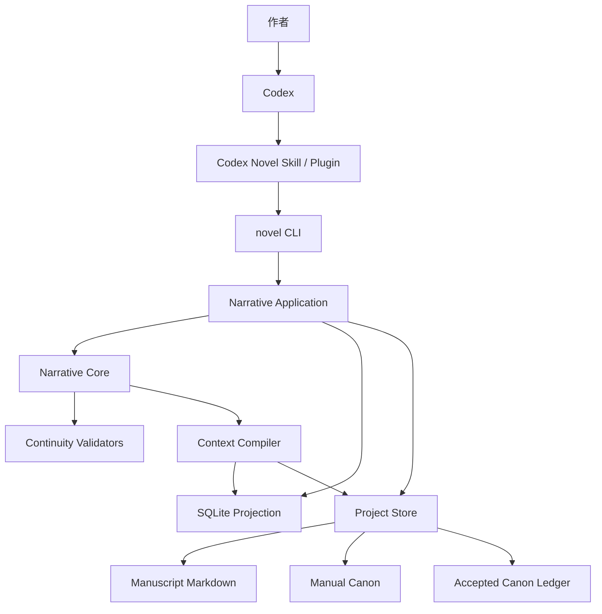

# MVP Narrative Core 核心架构

> 状态：核心架构讨论稿 v0.1
> 日期：2026-07-24
> 产品范围：纯本地客户端；MVP 聚焦 Codex 插件与 Narrative Core

相关业务设计：[历史情节的检索](./04-historical-plot-retrieval.md)

相关运行设计：[运行环境与本地分发](./05-runtime-and-local-distribution.md)

## 1. 已确认的产品边界

MVP 不建设云端业务服务，不提供网页端写作，不处理：

- 用户账户
- 多租户
- 云端小说生成
- 云同步
- 多人实时协作
- 在线计费
- 服务端任务队列

MVP 的唯一执行环境是用户本地项目，AI 能力由用户自己的 Codex 环境提供。

当前阶段的核心目标是验证：

> Codex 能否通过稳定的本地工具协议，与 Narrative Core 配合完成长篇小说的状态维护、上下文编译、正文生成、历史梳理和连续性校验。

## 2. MVP 总体架构



依赖方向必须单向：

```text
Codex Skill
    ↓
CLI / Application
    ↓
Narrative Core
    ↑
Storage / SQLite / Codex Adapters
```

Codex Skill 不直接修改数据库，不承载领域规则，也不自行决定哪些候选事实成为正式 Canon。

## 3. 能力分级

### 3.1 MVP 必须实现

| 能力 | 必须实现的原因 |
| --- | --- |
| 稳定实体 ID | 名字、称号和身份会变化，不能用显示名称作为主键 |
| 场景与叙述顺序 | 所有状态变化必须有明确发生位置 |
| 故事时间与叙述顺序分离 | 支持倒叙、多视角和历史状态查询 |
| 人物状态历史 | 不能只保存“当前人物卡” |
| 人物知识与世界真相分离 | 防止悬疑、多视角故事发生知识泄漏 |
| 事件及事件因果关系 | 用于梳理历史剧情和解释当前状态 |
| 剧情线与伏笔状态 | 防止长期支线遗忘 |
| 来源追踪 | 每条事实必须能返回原文或人工设定 |
| Canon 候选变更与审批 | 防止模型幻觉直接污染正式记忆 |
| Context Compiler | 每次只向 Codex 提供任务所需上下文 |
| SQLite 投影和可重建索引 | 支持高效查询且保持项目可迁移 |
| 确定性检索与全文检索 | 向量相似度不能承担事实判断 |
| Schema 版本与 migrations | 核心数据结构一定会迭代 |
| 一组可重复的连续性评测 | 防止架构只在演示样例中有效 |

### 3.2 MVP 可以预留接口但暂不实现

| 能力 | MVP 做法 |
| --- | --- |
| 向量语义检索 | 定义 `SemanticRetriever` 接口，不生成 Embedding |
| Claude Code | 定义 `AgentRuntime` 接口，只实现 Codex 工作流 |
| 桌面应用 | 不开发；CLI 和项目文件即 MVP UI |
| 长驻 Sidecar | 不开发；CLI 短进程和 JSONL 文件足够 |
| 本地小模型 | 不集成 |
| 自动多智能体协作 | 用多个顺序工作流代替 |
| 多种 Genre Pack | 核心保持通用，只做一个标杆类型 |
| 高级关系图和时间线可视化 | 先提供结构化查询和报告 |
| DOCX、EPUB 等复杂导出 | 先导出 Markdown 或纯文本 |
| 自动 Git 分支策略 | 先生成 Diff 和 checkpoint 建议 |

### 3.3 本地产品当前不需要

- FastAPI
- PostgreSQL
- Redis
- Kafka、RabbitMQ、Celery 等消息或任务系统
- MongoDB
- Neo4j 或其他独立图数据库
- Pinecone、Milvus、Qdrant 等独立向量服务
- Kubernetes、Docker 化服务部署
- OAuth、团队权限和多租户
- S3 对象存储

## 4. Narrative Core 模块边界

建议拆分为以下纯领域模块：

```text
novel_core/
├── identity/       # Entity、稳定 ID、别名
├── chronology/     # 故事时间、叙述顺序、时间线
├── canon/          # Proposition、Assertion、Change Set
├── characters/     # 人物状态、目标、关系、知识
├── events/         # 事件、参与者、因果关系和影响
├── plotting/       # 卷、剧情弧、剧情线、伏笔
├── scenes/         # 场景卡、进入状态和离开状态
├── context/        # Context Compiler
├── retrieval/      # 查询计划与检索结果
├── validation/     # 连续性、因果和知识校验
└── schemas/        # Pydantic 模型与 JSON Schema
```

外层应用模块：

```text
novel_application/
├── commands/
├── queries/
├── workflows/
├── changesets/
└── ports/
```

适配器：

```text
novel_adapters/
├── sqlite/
├── filesystem/
├── git/
└── codex/
```

核心包不导入 `sqlite3`、Typer、Codex 或 Git 库。它只接受领域对象并返回领域结果。

## 5. Canon 的权威边界

“所有文件都是 Canon”过于宽泛，“所有数据都只在 SQLite”也不适合可审查的本地写作项目。

建议把权威数据分成三类：

### 5.1 Text Canon

作者批准的正文：

```text
manuscript/
```

格式为 UTF-8 Markdown。正文是故事表达的最终来源，但不是高效状态查询的数据结构。

### 5.2 Intent Canon

作者主动定义、不应被模型擅自改变的设定：

```text
canon/manual/
structure/
novel.yaml
```

包括：

- 世界硬规则
- 人物核心设定
- 结局和关键节点
- 类型约束
- 场景卡
- 禁止修改项

使用 Markdown + YAML Front Matter 或 YAML，并由 Pydantic Schema 校验。

### 5.3 Narrative Canon Ledger

从已批准正文产生的正式事件、状态变化和人物知识变化：

```text
canon/ledger/
```

Ledger 由 CLI 写入，采用不可变 Change Set。每个 Change Set 包含：

```yaml
id: change-...
base_revision: ...
source_scene_id: scene-...
operations:
  - op: assert
    proposition: ...
    scope: ...
    valid_from: ...
    source_ref: ...
approved_at: ...
```

修改错误事实时，不直接重写历史记录，而是追加 `retract`、`supersede` 或 `correct` 操作。

### 5.4 SQLite Projection

SQLite 是以上三类正式数据的运行投影，并额外保存：

- 未批准候选变更
- 索引
- 缓存元数据
- 工作流状态
- 文档哈希
- Schema 版本

SQLite 可以通过 Text Canon、Intent Canon 和 Ledger 重建。

因此更准确的结论是：

> 正文、人工设定和已批准 Change Set 是权威记录；SQLite 是事务性运行模型和查询投影。

## 6. 为什么需要 Canon Ledger

如果只保存人物的“当前状态”，系统无法回答：

- 第 30 章时人物住在哪里？
- 某角色是在什么时候知道秘密的？
- 第 50 章的回忆场景中人物是否已经受伤？
- 某段关系是在什么事件后恶化的？
- 当前状态来自哪段正文？

如果每次都重新扫描整本小说，成本高、结果不稳定，而且不同模型可能得到不同结论。

Ledger 的作用是保存经过批准的历史变化，使状态查询成为确定性计算，而不是每次重新让 AI 总结。

这是一种轻量的事件记录机制，但不要求整个程序采用复杂的全量 Event Sourcing。

## 7. 核心数据模型

### 7.1 Entity

任何长期存在并可被引用的对象都使用稳定 ID：

- Character
- Location
- Organization
- Item
- Ability
- Rule
- Secret
- Plot Thread

最小字段：

```text
entity_id
entity_type
display_name
status
created_revision
retired_revision
```

名称、称号和身份通过 Alias 表管理，不使用名称作为外键。

### 7.2 Alias

```text
alias_id
entity_id
alias_text
alias_type
valid_from
valid_to
used_by
```

`used_by` 可以表示某个称呼只由特定人物或组织使用。

### 7.3 Proposition

Proposition 只描述一个可以被相信、否认或怀疑的命题，本身不声明真假：

```text
proposition_id
subject_entity_id
predicate
object_kind
object_entity_id
object_value
qualifiers_json
```

示例：

```text
林远 / 身份是 / 皇子
玉佩 / 位于 / 密室
苏晚 / 信任 / 林远
```

### 7.4 Assertion

Assertion 表示某个范围内对 Proposition 的立场：

```text
assertion_id
proposition_id
scope_kind
holder_entity_id
stance
certainty
valid_from
valid_to
source_ref_id
change_set_id
```

`scope_kind`：

- `objective`：世界客观事实
- `character`：人物的知识或信念
- `reader`：读者在当前叙述位置已获得的信息
- `narrator`：叙述者作出的陈述

`stance`：

- `true`
- `false`
- `unknown`
- `suspected`
- `claimed`
- `disbelieved`

这样可以表达：

- 客观事实是甲。
- 侦探怀疑乙。
- 读者尚不知道。
- 不可靠叙述者声称是丙。

知识状态不能只引用客观真事实，因为人物也会相信错误命题。

### 7.5 Story Time

必须同时保存：

```text
narrative_order
timeline_id
story_time_kind
story_time_start
story_time_end
time_anchor_event_id
display_time
```

- `narrative_order`：读者看到场景的顺序。
- `story_time_*`：事件在故事世界中发生的时间。
- `timeline_id`：MVP 固定为 `main`，但字段从第一版存在。
- `story_time_kind`：exact、ordinal、relative、interval、unknown。

不要直接把所有故事时间设计成系统 `datetime`。玄幻、历史架空和时间循环可能需要自定义历法或相对时间。

### 7.6 Scene

```text
scene_id
chapter_id
narrative_order
timeline_id
story_time
pov_entity_id
location_entity_id
status
source_document_id
revision
```

`status` 至少包括：

- planned
- drafting
- candidate
- approved
- superseded

### 7.7 Event

```text
event_id
event_type
timeline_id
story_time
source_scene_id
summary
canon_status
```

关联表：

- `event_participants`
- `event_locations`
- `event_effects`
- `event_edges`

`event_edges.edge_type` 可以是：

- causes
- enables
- prevents
- reveals
- foreshadows
- pays_off
- contradicts

事件因果关系构成轻量图，但不需要图数据库。

### 7.8 Character Goal 与状态

人物状态不应保存为一个不断覆盖的 JSON 大对象。应拆成有来源和有效期的 Assertion，例如：

- 当前地点
- 身体状态
- 持有物
- 社会身份
- 目标
- 恐惧
- 承诺
- 阵营
- 关系

“人物快照”是查询加速结果，可以重建。

### 7.9 Plot Thread

```text
thread_id
thread_type
promise
opened_scene_id
expected_payoff_range
current_state
last_advanced_scene_id
resolved_scene_id
```

状态变化单独保存在 `plot_thread_transitions`，而不是只覆盖 `current_state`。

### 7.10 Source Ref

```text
source_ref_id
document_id
scene_id
document_revision
fragment_ordinal
quote_hash
excerpt
```

直接保存字符偏移不够可靠，因为正文编辑会移动位置。MVP 使用场景文件、段落序号和片段哈希组合定位；重新索引时可以修复偏移。

## 8. 状态重建

查询“某场景开始前的人物状态”时：

1. 找到场景的 `timeline_id` 和故事时间。
2. 查询该人物相关的 Proposition。
3. 过滤在目标时间有效的 objective Assertions。
4. 按 Change Set 和有效期消解 supersede/retract。
5. 查询人物作为 holder 的 knowledge Assertions。
6. 合并人物目标、关系、位置、物品和身体状态。
7. 返回状态及每一项的 Source Ref。

为了减少重复计算，可以生成：

```text
character_snapshots
scene_entry_snapshots
scene_exit_snapshots
```

Snapshot 是派生数据。任何底层 Assertion 改变后，按受影响时间范围失效和重建。

## 9. 数据库选型

### 9.1 选择 SQLite

SQLite 与产品边界匹配：

- 嵌入式单文件，不需要安装服务。
- 支持事务、外键、索引和 WAL。
- FTS5 提供全文检索。
- JSON 函数可以保存低频扩展字段。
- Recursive CTE 可以处理事件和关系图遍历。
- 数据量远低于需要分布式数据库的规模。
- 由 Python 标准库直接使用。

SQLite WAL 允许读者和写者更好地并行；Recursive CTE 可以执行树和图遍历；FTS5 支持全文查询、相关度和 trigram tokenizer。

### 9.2 MVP 不使用 ORM

建议使用：

```text
Python sqlite3
显式 Repository
编号 SQL migration 文件
Pydantic 领域模型
```

不在 MVP 中引入 SQLAlchemy ORM，原因是：

- 产品已确定只使用本地 SQLite，不需要伪数据库可移植性。
- FTS5、递归 CTE、部分索引和 SQLite PRAGMA 都是数据库特定能力。
- 时间化 Assertion 查询使用显式 SQL 更容易审查和优化。
- 减少 ORM identity map、隐式加载和迁移抽象带来的复杂度。

如果后续出现明确需求，可以在适配器层引入 SQLAlchemy Core，但 Narrative Core 不受影响。

### 9.3 连接策略

MVP 使用：

- 一个只写连接，由 Application 层串行管理。
- 必要时创建短生命周期只读连接。
- `foreign_keys=ON`
- WAL
- `busy_timeout`
- Schema version
- 启动时完整性检查
- 关闭和 checkpoint 策略

Codex Skill 和其他脚本不能绕过 CLI 直接写数据库。

### 9.4 为什么不选择其他数据库

#### PostgreSQL

需要常驻服务和运维，不符合纯本地产品。其并发和多用户优势在当前不存在。

#### DuckDB

适合分析扫描，不适合作为包含频繁小事务、审批状态和任务恢复的主要应用数据库。

#### MongoDB

需要独立服务；核心查询依赖时间有效性、关系约束和事务，文档自由结构已经由 Markdown/YAML 提供。

#### 图数据库

小说项目中的事件和人物关系规模有限。SQLite 边表、索引和 Recursive CTE 足以完成因果链、关系路径和伏笔回收查询。

#### Redis

没有分布式缓存、共享锁或多实例任务需求。

## 10. 建议的 SQLite 表组

### 10.1 权威投影

```text
entities
entity_aliases
documents
scenes
propositions
assertions
events
event_participants
event_edges
plot_threads
plot_thread_transitions
source_refs
canon_changesets
canon_change_operations
```

### 10.2 派生投影

```text
character_snapshots
scene_entry_snapshots
scene_exit_snapshots
chapter_summaries
arc_summaries
text_chunks
document_fts
retrieval_links
```

### 10.3 工作流与恢复

```text
workflow_runs
workflow_steps
candidate_changesets
validation_findings
document_hashes
index_versions
schema_migrations
```

### 10.4 暂不创建

```text
users
teams
permissions
billing
cloud_sync
remote_jobs
vector_ann_index
```

## 11. 历史剧情梳理机制

一章或一个场景批准后，由 Codex 生成候选 State Delta：

```yaml
events:
assertions:
knowledge_changes:
goal_changes:
relationship_changes:
thread_transitions:
foreshadowing:
payoffs:
unresolved_questions:
summary:
```

Narrative Core 执行：

1. Schema 校验。
2. ID 和别名解析。
3. 来源场景校验。
4. 时间有效性校验。
5. 与现有 Assertions 比较。
6. 发现硬冲突、软冲突和可能的刻意矛盾。
7. 生成候选 Change Set。
8. 展示给作者或 Codex 审核流程。
9. 批准后写入 Ledger 并更新 SQLite。

摘要分层：

- Scene Summary
- Chapter Summary
- Arc Summary
- Volume Summary

摘要是派生导航信息，不能替代 Event、Assertion 和原文证据。

## 12. 检索架构

Context Compiler 使用分层检索，而不是一次全局相似度搜索。

### 12.1 第一层：任务路由

从 Scene Card 获取：

- POV
- 出场人物
- 地点
- 时间
- 剧情线
- 场景目标
- 必须出现与禁止出现的信息

### 12.2 第二层：确定性状态查询

查询：

- 出场人物的场景进入状态
- POV 人物的知识与误解
- 地点当前状态
- 相关物品归属
- 活跃剧情线
- 直接因果事件
- 尚未回收的伏笔

这些查询不能使用向量相似度决定结果。

### 12.3 第三层：图扩展

从人物、事件和剧情线沿边扩展有限深度：

- 事件原因和结果
- 人物直接关系
- 伏笔与回收
- 当前冲突相关的历史事件

使用 SQLite 关联表和 Recursive CTE。

### 12.4 第四层：全文检索

从原文中寻找：

- 专有名词
- 关键台词
- 物品描述
- 地点细节
- 长词组和重复意象

使用 FTS5，并保留原文 Source Ref。

### 12.5 第五层：语义检索

只在启用时补充：

- 语义相似但词汇不同的历史场景
- 相似情绪或主题
- 远距离呼应
- 风格样例

语义结果是候选证据，必须经过实体、时间和来源过滤。

## 13. 中文全文检索

MVP 推荐：

1. 人物名、别名、地点名和专有名词使用普通关系表精确查询。
2. 三个汉字及以上的词组和原文片段使用 FTS5 trigram。
3. 两个汉字的名字不能依赖 trigram MATCH。
4. 短词使用别名表、规范化词典或受控 `LIKE` 查询。
5. 后续根据评测决定是否加入自定义中文 tokenizer。

在当前开发环境的 SQLite 3.49.1 实测中：

- JSON 函数可用。
- Recursive CTE 可用。
- FTS5 trigram 对三个汉字的查询有效。
- 两个汉字的 `MATCH` 不返回结果。
- 两个汉字可以通过别名精确查询或受控 `LIKE` 找到。

因此，FTS5 是全文证据检索的一部分，不能代替实体别名索引。

## 14. 是否需要向量数据库

### 14.1 结论

> MVP 不需要向量数据库，也不应把向量检索作为 Canon 记忆的基础。

原因：

1. 人物状态、时间、知识和因果关系都是结构化精确查询问题。
2. 单本小说的文本块数量有限，不需要独立 ANN 服务。
3. 向量相似不代表事实相关，更不代表事实正确。
4. Embedding 模型变化会导致索引重建和结果漂移。
5. 纯本地 Embedding 会引入模型下载、CPU/GPU、内存和跨平台打包问题。
6. 使用远程 Embedding API 又会增加密钥、费用和隐私配置。

### 14.2 架构上必须预留

定义：

```text
SemanticRetriever.search(
    query,
    filters,
    limit
) -> list[SemanticHit]
```

但 MVP 默认使用 `NoOpSemanticRetriever`。

文本块表从第一版保存：

```text
chunk_id
document_id
scene_id
entity_ids
timeline_id
story_time
content_hash
text
```

这样后续加入 Embedding 不需要重新设计文档和过滤模型。

### 14.3 后续最小实现

如果评测证明语义召回有价值：

1. 生成本地或用户配置的 Embedding。
2. Embedding 以 BLOB 或矩阵文件保存。
3. 元数据继续保存在 SQLite。
4. Python 进程内执行精确余弦相似度。
5. 先过滤人物、时间线和剧情线，再计算相似度。

单本小说即使切成数千到数万个文本块，初期也可以使用精确扫描验证价值，未必需要 ANN 索引。

### 14.4 暂不把 sqlite-vec 设为核心依赖

`sqlite-vec` 的方向与本地产品匹配，但其项目当前仍明确标记为 pre-v1，并提示可能存在破坏性变更。因此可以作为后续实验适配器，不能成为 MVP 数据格式或核心查询语义的一部分。

## 15. Context Pack

Context Compiler 输出可审计的 Context Pack：

```text
context.json       # 结构化清单
context.md         # 供 Codex 阅读的文本
sources.json       # 所有来源与版本
budget.json        # 上下文预算
```

内容顺序：

1. 本次任务和场景卡。
2. 不可违反的 Intent Canon。
3. POV 人物知识边界。
4. 出场人物进入状态。
5. 相关事件因果链。
6. 活跃剧情线和伏笔。
7. 最近相邻场景原文。
8. 全文检索命中的历史证据。
9. 可选语义结果。
10. 输出格式和变更限制。

每个条目包含：

- 为什么被选中
- 来源文件
- 来源修订
- Story Time
- 是否为硬约束
- 是否允许模型修改

## 16. Codex 插件与 Core 的配合

插件保持轻量：

```text
plugins/codex-novel/
├── .codex-plugin/
├── skills/
│   ├── novel-init/
│   ├── novel-ingest/
│   ├── novel-plan/
│   ├── novel-write/
│   ├── novel-reconcile/
│   └── novel-check/
└── references/
```

Skill 只能通过稳定 CLI 调用 Core：

```text
novel init
novel ingest
novel query character <id> --at-scene <id>
novel context build <scene-id>
novel draft prepare <scene-id>
novel reconcile <scene-id> --delta <file>
novel changeset inspect <id>
novel changeset approve <id>
novel check continuity
novel rebuild
novel doctor
```

CLI 支持：

- 面向人的终端输出
- `--json` 机器输出
- 明确退出码
- 幂等命令
- Dry Run
- 所有写操作产生 Change Set 或运行记录

Codex 不应：

- 直接执行 SQL。
- 直接追加 Canon Ledger。
- 直接把草稿标记为 approved。
- 在没有 Source Ref 时创建正式事实。
- 绕过 Context Compiler 自行扫描整个项目作为默认流程。

## 17. MVP 单场景闭环

```text
1. novel context build scene-001
2. Codex 阅读 context.md
3. Codex 写入 staging draft
4. Codex 按 JSON Schema 输出 state-delta.json
5. novel reconcile 执行校验
6. Core 生成 candidate changeset
7. Codex 或作者查看冲突报告和 Diff
8. novel changeset approve
9. Core 更新正文、Ledger 和 SQLite
10. novel check continuity
```

第一版不要求完全自动无人审核。

## 18. 事务与恢复

文件系统和 SQLite 不能共享一个真正的数据库事务，因此批准流程必须可恢复并幂等：

1. 创建 Transaction Manifest。
2. 记录所有输入文件修订哈希。
3. 在 staging 目录生成新文件。
4. 验证 Schema 和冲突。
5. 原子替换单个文件。
6. 追加 Ledger Change Set。
7. 在 SQLite 事务中更新投影。
8. 将 Transaction 标记为 complete。

启动时检查未完成 Transaction：

- 未写正式文件：安全丢弃或重试。
- 文件已更新、SQLite 未更新：重放 Change Set。
- SQLite 已更新、状态未完成：校验哈希后完成。

所有步骤按 Change Set ID 幂等。

## 19. Schema 与迁移

从第一版建立：

```text
schemas/
├── project.schema.json
├── character.schema.json
├── scene-card.schema.json
├── state-delta.schema.json
└── canon-changeset.schema.json

backend/migrations/
├── 0001_initial.sql
├── 0002_knowledge_assertions.sql
└── ...
```

每次启动：

1. 检查项目格式版本。
2. 检查 SQLite Schema 版本。
3. 先备份。
4. 执行 migrations。
5. 验证能否从 Ledger 重建。

不要在 Pydantic 模型变化时静默改写旧项目。

## 20. 测试与评测

核心架构是否正确，必须由可重复测试决定。

### 20.1 领域单元测试

- Assertion 有效期
- 人物知识变化
- 错误信念
- 倒叙状态查询
- 别名变化
- 事件因果遍历
- Change Set retract/supersede

### 20.2 数据库集成测试

- migrations
- WAL 下读写
- 崩溃恢复
- Ledger 重建
- FTS5 中文检索
- 事务幂等

### 20.3 连续性夹具

人工构造一部小型测试小说，包含：

- 人物改名
- 身份秘密
- 错误认知
- 物品易主
- 受伤与恢复
- 倒叙
- 未回收伏笔
- 刻意误导
- 一个真正的硬矛盾

系统必须区分：

- 世界事实矛盾
- 人物认知差异
- 不可靠叙述
- 合理状态变化
- 真正连续性错误

### 20.4 检索评测

每个场景准备应当召回的事实和原文证据，比较：

- 纯确定性查询
- 确定性 + FTS5
- 确定性 + FTS5 + 语义检索

只有第三种在真实样例中产生明确收益时，才加入 Embedding。

## 21. 推荐实施顺序

### M0：领域模型

- Entity
- Story Time
- Proposition
- Assertion
- Event
- Source Ref
- Change Set

验收：可以表达世界事实、人物错误认知和倒叙。

### M1：项目存储与 SQLite

- 项目目录
- Schema
- migrations
- Ledger
- Projection rebuild
- 基础查询

验收：删除 `.novel/project.sqlite` 后可以完整重建。

### M2：历史导入

- 导入若干章节
- Codex 输出候选 Delta
- 审批
- 生成人物状态和事件链

验收：能回答“某人物在某场景时知道什么、在哪里、目标是什么，并给出来源”。

### M3：Context Compiler

- Scene Card
- 状态查询
- 因果扩展
- FTS5
- Context Pack

验收：无需输入整本小说即可准备下一场景。

### M4：Codex 写作闭环

- Draft
- Delta
- Reconcile
- Approve
- Continuity Check

验收：连续完成多个场景，并保持状态可追溯。

### M5：评测后决定语义检索

不以“大家都使用向量库”为理由引入 Embedding，只看检索评测结果。

## 22. 当前推荐决策

建议锁定：

1. 纯本地，无远程业务服务。
2. MVP 只实现 Codex 插件、CLI 和 Narrative Core。
3. Python + Pydantic 作为领域核心。
4. Python `sqlite3` + 显式 SQL migrations，不使用 ORM。
5. SQLite 是运行投影；正文、人工设定和 Canon Ledger 是权威记录。
6. 使用 Proposition + Assertion 表达事实、知识、误解和叙述声明。
7. 故事时间和叙述顺序从第一版分离。
8. 人物状态由历史 Assertions 计算，快照只用于加速。
9. SQLite 关系边和 Recursive CTE 代替图数据库。
10. FTS5 + 实体别名索引作为 MVP 检索。
11. 预留 SemanticRetriever，但 MVP 不引入向量数据库和 Embedding。
12. 桌面端、Claude Code、多类型 Genre Pack 延后。

## 23. 参考资料

- [SQLite Write-Ahead Logging](https://sqlite.org/wal.html)
- [SQLite FTS5](https://sqlite.org/fts5.html)
- [SQLite Recursive CTE](https://sqlite.org/lang_with.html)
- [SQLite JSON Functions](https://sqlite.org/json1.html)
- [sqlite-vec](https://github.com/asg017/sqlite-vec)
- [Codex App Server](https://developers.openai.com/codex/app-server)
