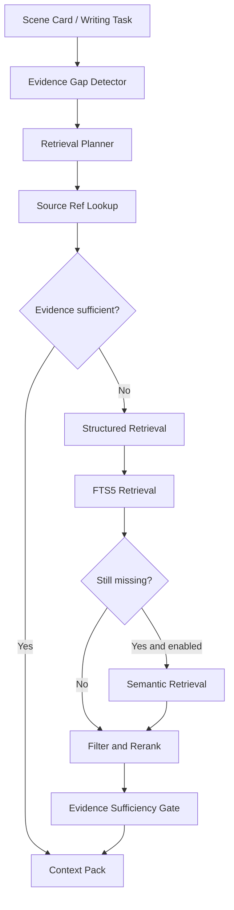

# 历史情节的检索

> 状态：业务设计考虑项 v0.1
> 日期：2026-07-23
> 适用范围：Codex Plugin / Skill / Agent、CLI、Narrative Core、Context Compiler

## 1. 目的

长篇小说写作不仅需要知道历史事件的结构化结果，还可能需要恢复当时的具体文本细节，例如：

- 人物说过的原话
- 对话语气
- 行为和细微动作
- 场景环境
- 情绪变化过程
- 重复出现的意象
- 某段关系发生变化时的具体表现

结构化 Canon 可以回答“发生了什么”和“人物当时知道什么”，但不能完整替代原始正文。

因此系统需要一套历史情节证据检索机制，在写作确实依赖历史细节时，从原文中召回相关场景和片段。

## 2. 核心结论

历史情节检索采用混合检索架构：

```text
Source Ref
→ 结构化实体、事件、时间和剧情线检索
→ FTS5 全文检索
→ 可选语义向量检索
→ 结果融合、过滤和证据验证
```

需要区分：

- 系统需要“语义检索能力”的扩展接口。
- MVP 不需要“独立向量数据库”。
- 向量相似度不能承担 Canon 事实判断。
- 最可靠的历史情节定位方式是 Event、Assertion 与原文 Source Ref 的直接链接。

## 3. 检索对象

历史情节检索返回的不是脱离上下文的普通文本，而是 Evidence：

```text
Evidence
  evidence_id
  source_document_id
  source_scene_id
  source_fragment
  document_revision
  story_time
  narrative_order
  entity_ids
  event_ids
  plot_thread_ids
  retrieval_reason
  retrieval_method
  relevance
  confidence
```

所有返回结果必须能够追溯到正式正文。

## 4. 什么时候需要检索

Context Compiler 根据当前任务中的“证据缺口”判断是否检索。

### 4.1 应当检索

- 当前场景明确引用较早的历史事件。
- 当前对话需要回应、重复或反转历史对话。
- 人物再次面对与历史相似的选择，需要保持行为连续。
- 当前场景准备回收伏笔。
- 需要保持某个物品、地点或动作的描写一致。
- 需要恢复结构化摘要中没有保存的具体行为和情绪过程。
- 当前剧情依赖较早场景，而该场景不在最近正文窗口中。
- 需要选取人物既有对话风格样例。
- 结构化 Canon 显示某段历史相关，但缺少可引用的原文证据。

### 4.2 不应检索

- 结构化状态已经足够完成当前任务。
- 所需原文已经位于最近场景上下文中。
- 当前场景与历史事件没有直接或潜在关系。
- 只需要事件结果，不需要恢复具体过程。
- 已经获得高可信 Source Ref。
- 继续召回只会产生重复文本。
- 上下文预算不足，且历史细节不是硬约束。

## 5. Evidence Requirement

Scene Card 或写作任务可以声明需要的证据：

```yaml
requirements:
  - id: evidence-requirement-001
    purpose: 恢复三年前争吵时的对话和行为
    evidence_type: raw_text
    required: true
    entities:
      - char-linyuan
      - char-suwan
    event_ids:
      - event-argument-003
    plot_thread_ids:
      - thread-identity-secret
    status: missing
```

推荐的 `evidence_type`：

- `fact`
- `dialogue`
- `behavior`
- `description`
- `emotion`
- `style_sample`
- `foreshadowing`
- `payoff`
- `causal_context`

检索系统不应只接收一段自然语言查询。它还应接收人物、事件、时间、地点和剧情线等结构化过滤条件。

## 6. 检索流程



### 6.1 Source Ref Lookup

如果 Event、Assertion 或 Plot Thread 已经包含 Source Ref，直接读取对应场景和片段。

```text
event_id
→ source_scene_id
→ source_fragment
```

这是第一优先级，不需要向量检索。

### 6.2 Structured Retrieval

通过以下信息缩小候选范围：

- Entity ID
- Alias
- Event ID
- Plot Thread ID
- Location ID
- POV
- Story Time
- Narrative Order
- Timeline ID

只在候选范围内继续搜索。

### 6.3 FTS5 Retrieval

用于查找：

- 专有名词
- 关键台词
- 地点和物品描述
- 长词组
- 重复意象

人物名、地点名、物品名和短别名仍然优先使用结构化索引。

### 6.4 Semantic Retrieval

用于召回词汇不同但语义相关的内容：

- 相似情绪
- 相似行为
- 没有明确关键词的背叛或怀疑
- 远距离主题呼应
- 风格和语言样例

语义结果只作为候选 Evidence。返回后仍需进行：

- Entity 过滤
- Story Time 过滤
- Timeline 过滤
- Plot Thread 过滤
- Canon 状态过滤
- Source Ref 验证

## 7. 检索粒度

正文索引至少保留两级：

```text
Scene
└── Passage / Paragraph Chunk
```

推荐文本块字段：

```text
chunk_id
document_id
scene_id
chapter_id
fragment_ordinal
entity_ids
event_ids
plot_thread_ids
timeline_id
story_time
pov_entity_id
content_hash
text
```

推荐先召回 Scene，再从 Scene 内选择 Passage。这样可以防止返回缺少前因后果的孤立段落。

## 8. Evidence Sufficiency Gate

系统需要明确的停止条件，避免无限检索。

满足以下条件之一时可以停止：

- 已找到明确且版本有效的 Source Ref。
- 已找到满足 `required` Evidence Requirement 的原文。
- 必要人物、时间和剧情线覆盖完整。
- 新结果与已有结果高度重复。
- 结果相关度低于阈值。
- 达到上下文预算。
- 候选互相冲突，需要作者或上层 Agent 决策。

如果重要证据仍然不足，系统应明确返回：

```text
evidence_status: insufficient
```

不能使用低可信结果伪装成确定历史。

## 9. 结果排序

候选 Evidence 的排序可以综合：

- Source Ref 直接命中
- Event ID 命中
- Entity 重合
- Plot Thread 重合
- Story Time 合法性
- Narrative Order 合法性
- FTS5 相关度
- 可选语义相似度
- 与任务 Evidence Requirement 的覆盖度

硬过滤条件应先于分数排序。例如，发生在当前场景之后的内容不能因为向量相似度高而进入普通历史上下文。

## 10. Context Pack 集成

Context Pack 中的历史原文应记录：

```yaml
evidence:
  - requirement_id: evidence-requirement-001
    source_scene_id: scene-017
    source_fragment: paragraph-004
    retrieval_method: source_ref
    retrieval_reason: 恢复三年前争吵的具体对话
    confidence: high
    hard_constraint: true
```

这样可以回答：

- 为什么选择这段历史文本？
- 它支持当前场景的哪项要求？
- 是精确证据还是语义候选？
- 是否允许写作 Agent 忽略？

## 11. Codex Skill / Agent 中的设计要求

后续编辑 Codex Plugin、Skill 或 Agent 时，需要遵守：

1. 在写作前识别 Evidence Requirement。
2. 优先通过 CLI 请求历史证据，不自行默认扫描整本小说。
3. 不直接对数据库执行查询。
4. 不把向量搜索结果当作正式事实。
5. 对高风险历史引用要求 Source Ref。
6. 当 Evidence 不足时明确报告，不自行补造历史细节。
7. 写作完成后，把使用过的历史 Evidence 记录进 Run Manifest。

Skill 可以负责：

- 从 Scene Card 生成 Evidence Requirement。
- 调用 CLI。
- 阅读生成的 Evidence Pack。
- 在正文生成时遵守硬证据。

Skill 不负责：

- 检索排序实现。
- 数据库写入。
- Canon 审批。
- Embedding 管理。

## 12. CLI 中的设计要求

后续 CLI 可以考虑：

```text
novel evidence plan <scene-id>
novel evidence retrieve <requirement-id>
novel evidence inspect <evidence-id>
novel evidence explain <evidence-id>
novel evidence status <scene-id>
novel context build <scene-id> --with-evidence
```

所有命令应支持：

- `--json`
- Dry Run
- 明确退出码
- 可重复执行
- Context Budget
- Retrieval Trace

CLI 返回的是 Evidence 和检索报告，不直接生成未经审核的 Canon。

## 13. Narrative Core 中的设计要求

建议预留以下端口：

```text
EvidenceGapDetector
RetrievalPlanner
SourceRefRetriever
StructuredRetriever
FullTextRetriever
SemanticRetriever
EvidenceReranker
EvidenceSufficiencyGate
EvidencePackBuilder
```

统一接口示意：

```text
retrieve(
    requirement,
    filters,
    budget
) -> EvidenceResult
```

`EvidenceResult` 至少包含：

```text
hits
coverage
status
retrieval_trace
warnings
```

MVP 中：

- `SourceRefRetriever`：实现。
- `StructuredRetriever`：实现。
- `FullTextRetriever`：实现。
- `SemanticRetriever`：使用 `NoOpSemanticRetriever`。
- `EvidenceSufficiencyGate`：实现基础规则。

## 14. 向量能力的技术预留

MVP 不生成 Embedding，但数据结构从第一版保留：

- 稳定 `chunk_id`
- `content_hash`
- 结构化元数据
- Chunk 到 Scene 的关系
- `SemanticRetriever` 接口

如果后续评测证明需要语义召回：

1. 增加本地或用户配置的 Embedding Provider。
2. 向量保存为 SQLite BLOB 或本地矩阵文件。
3. 在 Python 中执行精确相似度搜索。
4. 先进行元数据过滤，再计算相似度。
5. 暂不引入独立向量数据库。

## 15. MVP 范围

### 必须实现

- Source Ref
- Event、Assertion、Plot Thread 到原文的链接
- Evidence Requirement
- Evidence Gap Detector 基础规则
- Structured Retrieval
- FTS5 Retrieval
- Evidence Sufficiency Gate
- Evidence Pack
- Retrieval Trace

### 暂不实现

- Embedding
- 向量数据库
- ANN 索引
- 自动查询改写模型
- 复杂神经重排模型
- 跨小说检索
- 用户自定义 Embedding 模型管理

## 16. 后续引入语义检索的判断标准

建立历史检索评测集，分别测试：

```text
结构化检索
结构化 + FTS5
结构化 + FTS5 + Semantic Retrieval
```

只有满足以下条件时才引入 Embedding：

- 存在稳定、重复出现的语义召回缺口。
- 缺口无法通过补充 Source Ref 或结构化关系解决。
- 语义检索能够提高相关历史片段召回。
- 错误候选和时间泄漏能够被后续过滤控制。
- 本地运行成本和索引体积可以接受。

## 17. 最终决策

1. 历史情节原文检索属于 Core 的必要业务能力。
2. MVP 采用 Source Ref、结构化查询和 FTS5。
3. 向量语义检索是后续可插拔召回层。
4. MVP 不引入独立向量数据库。
5. 从第一版保留文本块、元数据和 SemanticRetriever 接口。
6. Codex Skill 负责声明检索需求和使用 Evidence。
7. CLI 负责提供稳定检索命令和检索追踪。
8. Narrative Core 负责检索规划、过滤、充分性判断和 Context Pack 集成。
