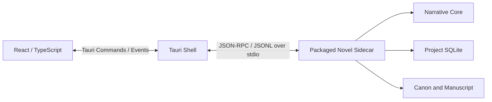

# Narrative Core 运行环境与本地分发

> 状态：技术设计候选方案 v0.1
> 日期：2026-07-24
> 适用范围：Narrative Core、CLI、Codex Plugin / Skill、未来桌面客户端

## 1. 目标

Narrative Core 和 CLI 在 MVP 阶段应便于开发、测试和被 Codex 调用；进入桌面阶段后，同一套业务代码应能随安装程序发布到用户电脑。

最终用户不应被要求：

- 安装 Python
- 创建虚拟环境
- 安装 SQLite 服务
- 启动本地 Web 服务
- 理解 Narrative Core 的内部依赖

## 2. 同一套 Core，多个运行入口

业务代码只保留一份：

```text
novel_core            # 纯领域逻辑
novel_application     # 用例、命令、查询和工作流
novel_adapters        # SQLite、文件、Git、Codex
novel_cli             # 短生命周期 CLI 入口
novel_sidecar         # 长生命周期桌面 IPC 入口
```

依赖关系：

```text
novel_cli
    └── novel_application
            └── novel_core

novel_sidecar
    └── novel_application
            └── novel_core
```

CLI 和 Sidecar 只是入口及生命周期不同，不能复制业务逻辑。

## 3. MVP 开发运行环境

建议基线：

```text
Python 3.12+
pyproject.toml
项目虚拟环境 .venv
Pydantic
Python sqlite3
显式 SQL migrations
```

CLI 通过 `pyproject.toml` 声明：

```toml
[project.scripts]
novel = "novel_cli.main:main"
```

开发阶段运行：

```text
Codex Skill
    ↓
.venv/bin/novel
    ↓
Narrative Application
    ↓
Narrative Core
```

每个 CLI 命令是短生命周期进程：

```text
novel init
novel context build scene-001
novel changeset inspect change-001
novel changeset approve change-001
novel check continuity
```

MVP 不需要：

- HTTP 服务
- FastAPI
- 本地端口
- Docker
- 常驻 daemon
- 桌面 Sidecar

## 4. 桌面阶段运行环境

桌面阶段复用同一套 Core，增加长生命周期入口：

```text
novel sidecar --stdio
```

进程关系：



选择 stdio 的原因：

- 不监听网络端口。
- 没有端口冲突。
- Sidecar 生命周期从属于桌面应用。
- 支持流式任务事件。
- 可以复用 CLI 的 JSON Schema 和应用服务。

## 5. Python 独立打包

建议第一版使用 PyInstaller 将 Python Runtime、依赖和 Narrative Core 打包为平台专用程序。

优先使用 `onedir`：

```text
novel-runtime/
├── novel
├── _internal/
├── schemas/
├── migrations/
└── builtin-resources/
```

选择 `onedir` 的原因：

- 桌面安装程序已经负责整体打包。
- 避免 `onefile` 每次启动解压到临时目录。
- Codex Skill 频繁调用 CLI 时启动更稳定。
- Schema、migration 和内置资源路径更易管理。
- 缺失动态库或资源时更易调试。

后续可以评估 Nuitka，但 MVP 和第一个桌面版本只维护一种 Python 打包链路。

## 6. Tauri 安装包

Tauri 将平台对应的 Novel Runtime 作为 `externalBin` 或应用资源打入安装包：

```text
Novel Desktop
├── React UI
├── Tauri Shell
├── Novel Runtime / Sidecar
├── schemas/
├── migrations/
├── builtin Genre Packs
└── Codex Plugin installation resources
```

每个操作系统和 CPU 架构需要独立构建：

```text
macOS arm64
macOS x86_64（如需要）
Windows x64
Linux x64（后续）
```

Python Runtime 和 Tauri Sidecar 都不是一次构建后跨平台通用的二进制。

## 7. Codex Plugin 如何定位 CLI

Codex Skill 不应依赖桌面 App Bundle 内部路径，也不应硬编码某个应用安装位置。

正式安装后需要稳定的用户级命令：

```text
macOS / Linux:
~/.local/bin/novel

Windows:
%LOCALAPPDATA%\Novel\bin\novel.exe
```

推荐结构：

```text
稳定 CLI Launcher
    ↓
当前版本 Novel Runtime
    ↓
Narrative Core
```

运行时本体可以保存在版本化目录：

```text
Application Support/Novel/runtime/<version>/
```

桌面更新可以原子切换当前 Runtime，Codex Skill 始终只调用稳定的 `novel` 入口。

首次运行由桌面应用提供明确操作：

```text
检测 Novel CLI
安装或修复 CLI 集成
检测 Codex
安装 Codex Plugin
检查 Codex 登录状态
运行 novel doctor
```

安装 Codex Plugin 或修改用户命令路径必须由用户明确触发。

## 8. Codex 的安装与认证

Novel 安装包不打包 Codex，也不复制用户的 ChatGPT / Codex 登录凭证。

桌面端只负责检测：

- `codex` 命令是否存在
- 所需 Codex 能力是否可用
- 当前是否已登录
- 能否启动任务

未安装或未登录 Codex 时：

- 用户仍可打开和编辑本地小说项目。
- Narrative Core、Canon、SQLite 和本地检索仍然可用。
- AI 写作工作流返回明确的 Runtime unavailable 状态。

## 9. 应用与项目数据分离

安装目录只包含程序：

```text
Application Installation
├── Desktop UI
├── Runtime
└── Built-in Resources
```

小说项目保存在用户选择的位置：

```text
my-novel/
├── novel.yaml
├── manuscript/
├── canon/
├── structure/
└── .novel/project.sqlite
```

必须保证：

- 应用升级不移动或覆盖小说项目。
- 卸载应用不默认删除小说项目。
- 项目可以被 Git 管理。
- Codex 可以直接在项目目录工作。
- 删除 `.novel/project.sqlite` 后仍能从权威记录重建。

全局设置、日志和 Runtime 版本信息使用操作系统的用户应用数据目录。

## 10. CLI 与桌面并发

未来可能同时存在：

- 桌面应用正在读取项目。
- Codex Plugin 通过 CLI 读取或写入同一项目。

处理原则：

- SQLite 启用 WAL。
- 多个读取可以并行。
- 所有写入必须经过 Narrative Application。
- 写操作获取项目级锁。
- 同一时间只允许一个批准或迁移事务。
- 桌面端通过项目 revision 或文件监视刷新。
- 冲突时 CLI 返回结构化 `project_busy`，不能覆盖写入。

MVP 不需要中心协调服务或 Redis 锁。

## 11. 版本与协议

从第一版保存：

```text
project_format_version
core_version
protocol_version
plugin_version
```

项目配置示例：

```yaml
project_format_version: 1
minimum_core_version: 0.1.0
```

CLI 提供：

```text
novel version --json
novel protocol-version
novel doctor
novel migrate --dry-run
```

Codex Plugin 启动工作流前检查协议版本。不兼容时必须停止写操作并给出升级提示。

## 12. 更新与迁移

桌面应用升级流程：

1. 更新桌面 UI 和 Novel Runtime。
2. 保留旧 Runtime，直到新版本健康检查通过。
3. 打开项目时检查格式和数据库版本。
4. 迁移前备份 SQLite 和待修改的权威文件。
5. 执行 migration。
6. 运行 `novel doctor`。
7. 失败时恢复旧 Runtime 和项目备份。

不能在安装程序中批量静默迁移所有小说项目。项目只在用户打开并确认后迁移。

## 13. 构建与发布验证

每个平台至少验证：

- CLI 能启动。
- Sidecar 能完成 initialize 和 shutdown。
- SQLite、JSON、FTS5 和 migrations 可用。
- 中文路径和空格路径可用。
- 项目目录位于外接盘或非默认目录时可用。
- Codex Skill 可以找到稳定 CLI 入口。
- 桌面和 CLI 并发读取可用。
- 写锁能够阻止并发批准。
- 升级不破坏现有项目。
- 卸载不删除项目。

macOS 还需要：

- arm64 构建
- 代码签名
- notarization

Windows 还需要：

- x64 构建
- 安装器
- 代码签名
- 路径和进程退出测试

## 14. MVP 与后续边界

### MVP 实现

- Python Package
- 虚拟环境运行
- `novel` CLI
- `pyproject.toml` 命令入口
- 项目格式和协议版本
- JSON 机器输出
- `novel doctor`

### 桌面阶段实现

- `novel sidecar --stdio`
- PyInstaller `onedir`
- Tauri `externalBin`
- 用户级稳定 CLI Launcher
- Codex Plugin 安装入口
- 平台安装包、签名和更新

### 当前不实现

- 本地 Web 服务
- 后台系统服务
- Docker Runtime
- 自动静默安装 Codex
- 凭证复制
- 云端更新项目数据

## 15. 技术决策

1. Narrative Core、CLI 和 Sidecar 共享同一套 Python 业务代码。
2. MVP 使用 Python 虚拟环境和短生命周期 CLI。
3. 桌面阶段使用 stdio JSON-RPC Sidecar，不启动本地 Web 服务。
4. Python Runtime 使用 PyInstaller `onedir` 打包。
5. Tauri 安装包包含平台专用 Runtime。
6. Codex Plugin 通过稳定的用户级 `novel` Launcher 调用 Core。
7. Codex 独立安装和登录，不随 Novel 安装包捆绑。
8. 小说项目独立于应用安装目录。
9. 项目格式、Core、协议和 Plugin 均具有独立版本。
10. 每个平台独立构建、签名和测试。

## 16. 参考资料

- [Python `pyproject.toml` Entry Points](https://packaging.python.org/en/latest/specifications/pyproject-toml/#entry-points)
- [PyInstaller](https://pyinstaller.org/en/stable/)
- [PyInstaller Usage](https://pyinstaller.org/en/stable/usage.html)
- [Tauri External Binaries / Sidecar](https://v2.tauri.app/develop/sidecar/)
